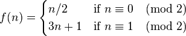

# Assignment 1: Recursion and Higher-Order Functional Abstractions

> Recursion is the root of computation since it trades description for time.    ——Alan Perils

### Guidelines for this assignment
Solutions must be naturally recursive (unless not possible), or credit will not be given.

You may not use built-in procedures that handle the bulk of the work. For example, you may not use the append function from Racket. But once you have defined your own append for problem 8, feel free to use it for other problems.

Using #lang typed/racket in your homework is optional.

Lists are assumed to be flat lists and not nested lists unless specified otherwise.

The objective is not simply to write programs that get the correct answers; it is to write answers in the style of programs written in class.

Make sure to title your file a1.rkt when you submit your homework.

Please feel free to submit your work as many times as you wish, we will grade the last submission prior to the due date (and time).

Note: As you proceed with this assignment, you may find the following resources helpful.

+ [Notes](../material/acker.scm) on recursive functions for repeated addition/multiplication/exponentiation/etc.
+ [Simplification](../material/ackermann.scm) of the Ackermann function to standard form.

### Assignment
Write the following recursive Racket procedures. Place all of your code in a file named a1.rkt, and submit it via Canvas. Please make sure your file has exactly this filename, and that it runs, before submitting.

0. Please read through our course policies before beginning the rest of the assignment.

1. Define and test a procedure countdown that takes a natural number and returns a list of the natural numbers less than or equal to that number, in descending order.

```racket
> (countdown 5)
(5 4 3 2 1 0)
```

2. Define and test a procedure insertL that takes two symbols and a list and returns a new list with the second symbol inserted before each occurrence of the first symbol. For this and later questions, these functions need only hold over eqv?-comparable structures.
```racket
> (insertL 'x 'y '(x z z x y x))
(y x z z y x y y x)
```
3. Define and test a procedure remv-1st that takes a a symbol and a list and returns a new list with the first occurrence of the symbol removed.
```racket
> (remv-1st 'x '(x y z x))
(y z x)
> (remv-1st 'y '(x y z y x))
(x z y x)
> (remv-1st 'z '(a b c))
(a b c)
```
4. Define and test a procedure map that takes a procedure p of one argument and a list ls and returns a new list containing the results of applying p to the elements of ls. Do not use Racket's built-in map in your definition.
```racket
> (map sub1 '(1 2 3 4))
(0 1 2 3)
```
5. Define and test a procedure filter that takes a predicate and a list and returns a new list containing the elements that satisfy the predicate. A predicate is a procedure that takes a single argument and returns either #t or #f. The number? predicate, for example, returns #t if its argument is a number and #f otherwise. The argument satisfies the predicate, then, if the predicate returns #t for that argument.
```racket
> (filter even? '(1 2 3 4 5 6))
(2 4 6)
```
6. Define and test a procedure zip that takes two lists and forms a new list, each element of which is a pair formed by combining the corresponding elements of the two input lists. If the two lists are of uneven length, then drop the tail of the longer one.
```racket
> (zip '(1 2 3) '(a b c))
((1 . a) (2 . b) (3 . c))
> (zip '(1 2 3 4 5 6) '(a b c))
((1 . a) (2 . b) (3 . c))
> (zip '(1 2 3) '(a b c d e f))
((1 . a) (2 . b) (3 . c))
```
7. Define and test a procedure list-index-ofv that takes an element and a list and returns the (base 0) index of that element in the list. A list missing that element will be considered bad data.
```racket
> (list-index-ofv 'x '(x y z x x))
0
> (list-index-ofv 'x '(y z x x))
2
```
8. Define and test a procedure append that takes two lists, ls1 and ls2, and appends ls1 to ls2.
```racket
> (append '(42 120) '(1 2 3))
(42 120 1 2 3)
> (append '(a b c) '(cat dog))
(a b c cat dog)
```
9. Define and test a procedure reverse that takes a list and returns the reverse of that list.
```racket
> (reverse '(a 3 x))
(x 3 a)
```
10. Define and test a procedure repeat that takes a list and a natural number and returns a new list with repeating sequence of the input list. The number of times the new list repeats is equal to the natural number that is one of the arguments.
```racket
> (repeat '(4 8 11) 4)
'(4 8 11 4 8 11 4 8 11 4 8 11)
```
11. Define and test a procedure same-lists* that takes two lists, possibly nested and returns #t if they are equal and #f otherwise.
```racket
> (same-lists* '() '())
#t
> (same-lists* '(1 2 3 4 5) '(1 2 3 4 5))
#t
> (same-lists* '(1 2 3 4) '(1 2 3 4 5))
#f
> (same-lists* '(a (b c) d) '(a (b) c d))
#f
> (same-lists* '((a) b (c d) d) '((a) b (c d) d))
#t
```
12. The expressions (a b) and (a . (b . ())) are equivalent. Using this knowledge, rewrite the expression ((w x) y (z)) using as many dots as possible. Be sure to test your solution using Racket's equal? predicate. (You do not have to define a rewrite procedure; just rewrite the given expression by hand and place it in a comment.)

13. Define and test a procedure binary->natural that takes a flat list of 0s and 1s representing an unsigned binary number in reverse bit order and returns that number. For example:
```racket
> (binary->natural '())
0
> (binary->natural '(0 0 1))
4
> (binary->natural '(0 0 1 1))
12
> (binary->natural '(1 1 1 1))
15
> (binary->natural '(1 0 1 0 1))
21
> (binary->natural '(1 1 1 1 1 1 1 1 1 1 1 1 1))
8191
```
14. Define division using natural recursion. Your division function, div, need only work when the second number evenly divides the first (that is, for the divisible abelian group that's a subgroup of Nat). Division by zero is of course bad data.
```racket
> (div 25 5)
5
> (div 36 6)
6
```
15. Define a function append-map that, similar to map, takes both a procedure p of one argument a list of inputs ls and applies p to each of the elements of ls. Here, though, we mandate that the result of p on each element of ls is a list, and we append together the intermediate results. Do not use Racket's built-in append-map in your definition.
```racket
> (append-map countdown (countdown 5))
(5 4 3 2 1 0 4 3 2 1 0 3 2 1 0 2 1 0 1 0 0)
```
16. Define a function set-difference that takes two flat sets (lists with no duplicate elements) s1 and s2 and returns a list containing all the elements in s1 that are not in s2.
```racket
> (set-difference '(1 2 3 4 5) '(2 6 4 8))
(1 3 5)
```
17. Define and test a function foldr which takes 3 arguments: a binary function, an initial accumulator value and a list. This function traverses the list from right to left, and for each element it passes the current list element and current accumulator value to the binary function then it updates the accumulator by assigning to it the return value of this function. The result of this function is the final accumulator value after traversing through the entire list.
```racket
> (foldr cons '() '(1 2 3 4))
'(1 2 3 4)
> (foldr + 0 '(1 2 3 4))
10
> (foldr * 1 '(1 2 3 4))
24
```
### Brainteasers

18. In mathematics, the power set of any set S, denoted P(S), is the set of all subsets of S, including the empty set and S itself.

The procedure powerset takes a list and returns the power set of the elements in the list. The exact order of your lists may differ; this is acceptable.
```racket
> (powerset '(3 2 1))
((3 2 1) (3 2) (3 1) (3) (2 1) (2) (1) ())
> (powerset '())
(())
```
19. The cartesian-product is defined over a list of sets (again simply lists that by our agreed upon convention don't have duplicates). The result is a list of tuples (i.e. lists). Each tuple has in the first position an element of the first set, in the second position an element of the second set, etc. The output list should contains all such combinations. The exact order of your tuples may differ; this is acceptable.
```racket
> (cartesian-product '((5 4) (3 2 1)))
((5 3) (5 2) (5 1) (4 3) (4 2) (4 1))
```
20. Rewrite some of the natural-recursive programs from above instead using foldr. That is, the bodies of your definitions should not refer to themselves. The names should be the following:
```txt
insertR-fr
filter-fr
map-fr
append-fr
reverse-fr
binary->natural-fr
append-map-fr
set-difference-fr
powerset-fr
```
If you would like, I can recommend a [treatise](https://www.cs.nott.ac.uk/~pszgmh/fold.pdf) on fold operators containing answers to several of the above sub-problems. It will also teach you about programming with foldr. There are stunningly beautiful definitions of the last two sub-problems. They're just mind-blowing. And to tease you further, know that some (pretty clever, albeit) folk solved this almost 50 years ago, back when lexical scope wasn't a thing, higher-order functions weren't commonplace like they are today, and many of the common programming idioms and that we take for granted just weren't around. Since I hate to pass up an excuse to show off something cool, I gotta tell you about the derivation and explanation of the last couple of answers here, but you have to promise (1) you'll try it first on your own, and (2) that if you peek at the answers, you'll read the whole thing. It's short, moves quickly, and very high enlightenment/text ratio. That's my sales pitch.

21. Consider a function f defined as below



Your task is to, complete the below definition of snowball. snowball should be a function which will, when given a positive integer as an input, should always return 1. It behaves like how f is defined above.

```racket
(define snowball
  (letrec
      ((odd-case
        (lambda (fix-odd)
          (lambda (x)
            (cond 
              ((and (exact-integer? x) (positive? x) (odd? x)) (snowball (add1 (* x 3)))) 
              (else (fix-odd x))))))
       (even-case
        (lambda (fix-even)
          (lambda (x)
            (cond 
              ((and (exact-integer? x) (positive? x) (even? x)) (snowball (/ x 2))) 
              (else (fix-even x))))))
       (one-case
        (lambda (fix-one)
          (lambda (x)
            (cond
              ((zero? (sub1 x)) 1)
              (else (fix-one x))))))
       (base
        (lambda (x)
          (error 'error "Invalid value ~s~n" x))))
    ... ;; this should be a single line, without lambda
    ))
```
Your completed answer should be very short. It should be no more than one (prettily-indented) line long, and should not use lambda. Your snowball should take a positive natural number as an argument; for non-positive natural numbers, it should signal an error “Invalid value”.

```racket
> (snowball 12)
1
> (snowball 120)
1
> (snowball 9999)
1
```

### Just Dessert
22. A quine is a program whose output is the listings (i.e. source code) of the original program. In Racket, 5 and #t are both quines.
```racket
> 5
5
> #t
#t
```
We will call a quine in Racket that is neither a number nor a boolean an interesting Racket quine. Below is an interesting Racket quine.

```racket
> ((lambda (x) (list x (list 'quote x)))
  '(lambda (x) (list x (list 'quote x))))
((lambda (x) (list x (list 'quote x)))
  '(lambda (x) (list x (list 'quote x))))
```
Write your own interesting Racket quine, and define it as quine. The following should then be true.
```racket
> (equal? quine (eval quine))
#t
> (equal? quine (eval (eval quine)))
#t
```
Not every Racket list is a quine; Racket's standard printing convention will prepend a quote to a list. Make sure to use the above tests.